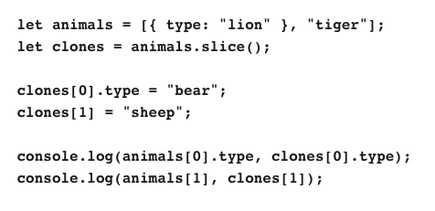
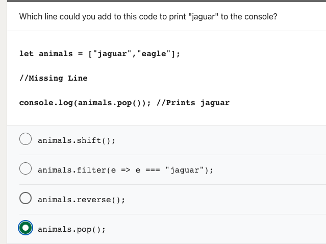
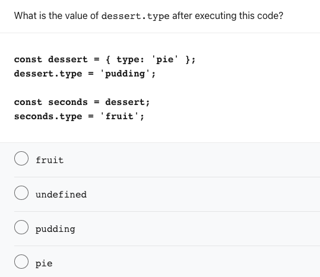
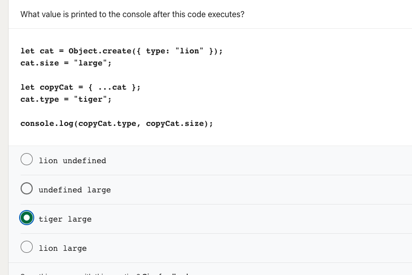
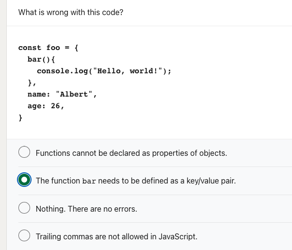

# What do you know?

Here some interesting notes about JavaScript.

## Destructuring assignment syntax

Reference [here](https://developer.mozilla.org/en-US/docs/Web/JavaScript/Reference/Operators/Destructuring_assignment) with an interest example below for [binding and assignment](https://developer.mozilla.org/en-US/docs/Web/JavaScript/Reference/Operators/Destructuring_assignment#binding_and_assignment).

```js
    const {
      data: { response }
      //cached
    } = await axios.get('https://cicero.azavea.com/v3.1/official', {
      params,
      paramsSerializer: (params) =>
      qs.stringify(params, { arrayFormat: 'repeat' }),
      
      cache: {
        // TODO: we are disabling the cache to test results first
        ttl: 1000 * 60 * 60 * 24 * 7 // the time until the cached value is expired in milliseconds: set to 1 week
      }
    }).catch((err) => {
      // error handling for not receiving a response
      // -> TypeError: Cannot read properties of undefined (reading 'data')
      console.error({
        message: 'request to get representative failed',
        code: err.code,
        cache: err.cache,
        data: err.data
      })
    })

    console.log(`🚀 -> file: representatives.js:117 -> router.get -> data`, response);

    // if you want to check if response was cached, uncomment: this is a way to track the issue
    // console.log('isCached:', cached)

    const { errors, results } = response
    if (errors.length > 0) {
      throw new Error(errors.join(','))
    }
    if (
      !results ||
      !Array.isArray(results.candidates) ||
      results.candidates.length === 0
    ) {
      throw new Error('No matches found for the search criteria')
    }
```

## Trick questions

<!-- Side note: I found it interesting that LinkedIn's JavaScript Assessment was a compilation of obscure questions that may or may not show that you know JavaScript well. -->

Are these questions testing your JavaScript skills?

### Working with arrays

```js
const a = ['a', 'b', 'c'];

a[100] = 'fox'

console.log(a.length) // prints: 101
```



```js
let animals = [{ type: "lion" }, "tiger"];
let clones = animals.slice();

clones[0].type = "bear";
clones[1] = "sheep";

console.log(animals[0].type, clones[0].type); // prints: 'bear' 'bear'
console.log(animals[1], clones[1]); // prints: 'tiger' 'sheep'
```

### Which line could you add to this code to print "jaguar" to the console?

````js 
let animals = ["jaguar", "eagle"];

// Missing Line

console.log(animals.pop()); // prints: jaguar
````



  - [ ] animals.shift(); <code lang="js" style={{color:"green"}} >// "eagle"</code>
  - [ ] animals.filter(e => e === "jaguar"); <code lang="js" style={{color:"green"}} >// "eagle"</code> 
  - [x] animals.reverse(); <code lang="js" style={{color:"green"}} >// "jaguar"</code>  
  - [x] animals.pop(); <code lang="js" style={{color:"green"}} >// "jaguar"</code>

Note: `shift()`, `reverse()`, `pop()` are methods that modify the original array, while `filter()` does not.

Unfortunately, this question did not accept multiple answers... Seems like the multiple choices were flawed. Am I wrong? 
_#CoughCough #LinkedInJavaScriptAssessment_

### What is the value of dessert.type after executing this code?

```js
const dessert = { type: 'pie' };
dessert.type = 'pudding';

const seconds = dessert;
seconds.type = 'fruit';
```

  - [x] fruit
  - [ ] undefined
  - [ ] pudding
  - [ ] pie

Note: Not only `seconds.type` has the value `fruit`, `seconds` is actually referencing `dessert` by address because it is an object type.

While `Object.assign` inherits `dessert`'s properties, it does create a new object (if used correctly).

```js
const dessert = { type: 'pie' };
dessert.type = 'pudding';
dessert.flavor = 'banana';

const seconds = Object.assign({}, dessert);
seconds.type = 'fruit';

console.log(dessert); // prints: { type: 'pudding', flavor: 'banana' }
console.log(seconds); // prints: { type: 'fruit', flavor: 'banana' }
```



<!--  -->

###

```js

const myObj = {
  myMethod(params) {
    console.log('myMethod works:', params)
    // ...do something here
  },
  myOtherMethod(params) {
    // ...do something here
    console.log('myOtherMethod works:', params)
  },
  nestedObj: {
    myNestedMethod(params) {
      // ...do something here
      console.log('myNestedMethod works:', params)
    }
  },
  oneMoreMethod(params) {
    console.log('This also works:', params)
  },
  ES6Method1: (params) => {
    console.log('This works in ES6:', params)
  }
};

myObj.myMethod(true);
myObj.myOtherMethod(true);
myObj.nestedObj.myNestedMethod(true);
myObj.oneMoreMethod(true);
myObj.ES6Method1(true); 
```

### What value is printed to the console after this code executes?

```js
let cat = Object.create({ type: "lion" });
cat.size = "large";

let copyCat = { ...cat };
cat.type = "tiger";

console.log(copyCat.type, copyCat.size); // prints: undefined, 'large'
```

<!--  -->

- [ ] lion undefined
- [x] undefined large
- [ ] tiger large
- [ ] lion large

In this case, I just misread the assignment of `cat.type = "tiger"` as `copyCat.type = "tiger"`. 
This is now more of a trick question than an assessment of JavaScript skills. This is especially tricky because people who are skilled at JavaScript typically don't practice this type of unclear code style. I fully accept that I just missed the detail though.


### What is wrong with this code? 

```js
const foo = {
  bar() {
    console.log("Hello, world!");
  },
  name: "Albert", 
  age: 26,
}
```


- [ ] Functions cannot be declared as properties of objects.
- [ ] The function bar needs to be defined as a key/value pair.
- [x] Nothing. There are no errors.
- [ ] Trailing commas are not allowed in JavaScript.

This is tricky because usually when something works, I'd typically go with it. Since there are multiple ways of declaring functions within an object, I'd choose what I prefer and keep using that syntax / style consistently. I definitely forgot about a the traditional methods of declaring functions within an object. (I got used to method #4 as I felt it was more declarative :smile:)

```js
function method2(params) {
  console.log('method2 works:', params)
}

const obj = {
  // traditional way: declaring a named function, 
  // which has the same key as the function name 
  // paired with the value of the function definition
  method1(params) {
    console.log('method1 works:', params)
  },
  // separating the function to outside of obj
  method2, 
  // nested function declaration works the same
  nestedObj: {
    myNestedMethod(params) { 
      console.log('myNestedMethod works:', params, '(though technically not another method)')
    }
  },
  // assigning the key method3 the value of an anonymous function
  method3: function (params) { 
    console.log('method3 also works:', params)
  },
  method4: function myOtherMethod(params) {
    console.log('method4 also works:', params)
  },
  // assigning the key method5 the value of an anonymous (arrow) function
  method5: (params) => {
    console.log('method5 works in ES6:', params)
  },
};

obj.method1(true); // prints: 'method1 works:' true
obj.method2(true); // prints: 'method2 works:' true
obj.nestedObj.myNestedMethod(true); 
// prints: 'myNestedMethod (technically not another method) works:' true
obj.method3(true); // prints: 'method3 also works:' true
obj.method4(true); // prints: 'method4 also works:' true
obj.method5(true); // prints: 'method5 works in ES6:' true
```

### localStorage 

Web Storage API gives us access to [sessionStorage](https://developer.mozilla.org/en-US/docs/Web/API/Window/sessionStorage) and [localStorage](https://developer.mozilla.org/en-US/docs/Web/API/Window/localStorage) (among other things).

```js
function populateStorage() {
  localStorage.setItem('bgcolor', 'red');
  localStorage.setItem('font', 'Helvetica');
  localStorage.setItem('image', 'myCat.png');
}
```