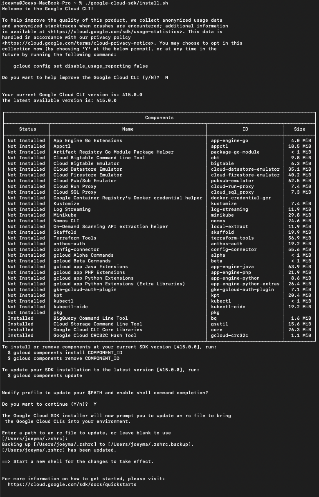
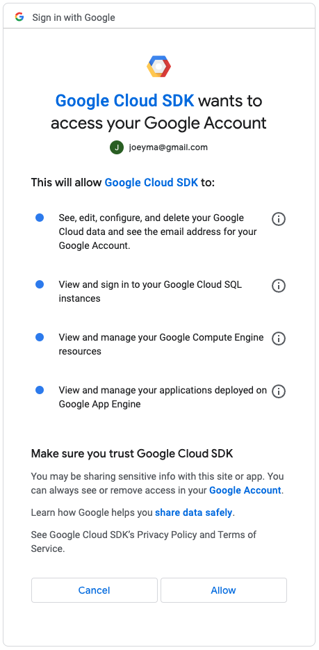

# GCP

## Google Cloud CLI

Follow instructions here to get set up.

https://cloud.google.com/sdk/docs/install-sdk#mac

For reference, here is a screen shot:



`gcloud --version` let's us confirm that it is installed.

```bash
~ % gcloud --version
Google Cloud SDK 415.0.0
bq 2.0.84
core 2023.01.20
gcloud-crc32c 1.0.0
gsutil 5.18
```

`gcloud auth login` allows us to use the web browser to login securely.

```bash
% gcloud auth login
Your browser has been opened to visit:

    https://accounts.google.com/o/oauth2/auth?response_type=code&client_id=32555940559.apps.googleusercontent.com&redirect_uri=http%3A%2F%2Flocalhost%3A8085%2F&scope=openid+https%3A%2F%2Fwww.googleapis.com%2Fauth%2Fuserinfo.email+https%3A%2F%2Fwww.googleapis.com%2Fauth%2Fcloud-platform+https%3A%2F%2Fwww.googleapis.com%2Fauth%2Fappengine.admin+https%3A%2F%2Fwww.googleapis.com%2Fauth%2Fsqlservice.login+https%3A%2F%2Fwww.googleapis.com%2Fauth%2Fcompute+https%3A%2F%2Fwww.googleapis.com%2Fauth%2Faccounts.reauth&state=5bLfnoz83eK7zMCnnUfz7MLxDvkYEJ&access_type=offline&code_challenge=kL64OouyVwk9rzqkLGrc-3cqA5twEfVkCLrFB5sJpJ8&code_challenge_method=S256

You are now logged in as [joeyma@gmail.com].
Your current project is [None].  You can change this setting by running:
  $ gcloud config set project PROJECT_ID
```



Let's config our project to use the correct PROJECT_ID. (In your app `root` directory, most likely backend `root` directory)

```bash
gcloud config set project todo-app-88a44
``` 
I am seeing: 

```bash
Updated property [core/project].
```

`gcloud app deploy` will begin uploading all of your files. 


## Firebase

Firebase 