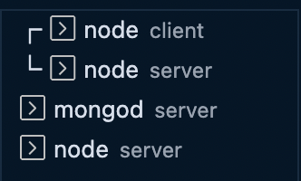

# MongoDB

Use the `--version` to check what is your current mongodb ("`mongod`") version.

```bash
$ mongod --version
db version v5.0.4
Build Info: {
    "version": "5.0.4",
    "gitVersion": "62a84ede3cc9a334e8bc82160714df71e7d3a29e",
    "modules": [],
    "allocator": "system",
    "environment": {
        "distarch": "x86_64",
        "target_arch": "x86_64"
    }
}
```

There are several Quickstart guides [here](https://www.mongodb.com/developer/quickstarts/).

Inside your backend root directory, you can set up your MongoDB server by doing: 

```bash
$ mongod --dbpath ./db # specifying the location of the db path
{"t":{"$date":"2023-01-28T09:37:05.601-08:00"},"s":"I",  "c":"CONTROL",  "id":23285,   "ctx":"thread2","msg":"Automatically disabling TLS 1.0, to force-enable TLS 1.0 specify --sslDisabledProtocols 'none'"}
{"t":{"$date":"2023-01-28T09:37:05.605-08:00"},"s":"I",  "c":"NETWORK",  "id":4915701, "ctx":"thread2","msg":"Initialized wire specification","attr":{"spec":{"incomingExternalClient":{"minWireVersion":0,"maxWireVersion":17},"incomingInternalClient":{"minWireVersion":0,"maxWireVersion":17},"outgoing":{"minWireVersion":6,"maxWireVersion":17},"isInternalClient":true}}}
{"t":{"$date":"2023-01-28T09:37:05.605-08:00"},"s":"I",  "c":"NETWORK",  "id":4648602, "ctx":"thread2","msg":"Implicit TCP FastOpen in use."}
{"t":{"$date":"2023-01-28T09:37:05.606-08:00"},"s":"I",  "c":"REPL",     "id":5123008, "ctx":"thread2","msg":"Successfully registered PrimaryOnlyService","attr":{"service":"TenantMigrationDonorService","namespace":"config.tenantMigrationDonors"}}
{"t":{"$date":"2023-01-28T09:37:05.606-08:00"},"s":"I",  "c":"REPL",     "id":5123008, "ctx":"thread2","msg":"Successfully registered PrimaryOnlyService","attr":{"service":"TenantMigrationRecipientService","namespace":"config.tenantMigrationRecipients"}}
{"t":{"$date":"2023-01-28T09:37:05.606-08:00"},"s":"I",  "c":"REPL",     "id":5123008, "ctx":"thread2","msg":"Successfully registered PrimaryOnlyService","attr":{"service":"ShardSplitDonorService","namespace":"config.tenantSplitDonors"}}
{"t":{"$date":"2023-01-28T09:37:05.606-08:00"},"s":"I",  "c":"CONTROL",  "id":5945603, "ctx":"thread2","msg":"Multi threading initialized"}
{"t":{"$date":"2023-01-28T09:37:05.606-08:00"},"s":"I",  "c":"CONTROL",  "id":4615611, "ctx":"initandlisten","msg":"MongoDB starting","attr":{"pid":6520,"port":27017,"dbPath":"./db","architecture":"64-bit","host":"Joeys-MacBook-Pro.local"}}
{"t":{"$date":"2023-01-28T09:37:05.606-08:00"},"s":"I",  "c":"CONTROL",  "id":23352,   "ctx":"initandlisten","msg":"Unable to resolve sysctl {sysctlName} (number) ","attr":{"sysctlName":"hw.cpufrequency"}}
{"t":{"$date":"2023-01-28T09:37:05.606-08:00"},"s":"I",  "c":"CONTROL",  "id":23351,   "ctx":"initandlisten","msg":"{sysctlName} unavailable","attr":{"sysctlName":"machdep.cpu.features"}}
{"t":{"$date":"2023-01-28T09:37:05.606-08:00"},"s":"I",  "c":"CONTROL",  "id":23403,   "ctx":"initandlisten","msg":"Build Info","attr":{"buildInfo":{"version":"6.0.4","gitVersion":"44ff59461c1353638a71e710f385a566bcd2f547","modules":[],"allocator":"system","environment":{"distarch":"aarch64","target_arch":"aarch64"}}}}
{"t":{"$date":"2023-01-28T09:37:05.606-08:00"},"s":"I",  "c":"CONTROL",  "id":51765,   "ctx":"initandlisten","msg":"Operating System","attr":{"os":{"name":"Mac OS X","version":"21.6.0"}}}
{"t":{"$date":"2023-01-28T09:37:05.606-08:00"},"s":"I",  "c":"CONTROL",  "id":21951,   "ctx":"initandlisten","msg":"Options set by command line","attr":{"options":{"storage":{"dbPath":"./db"}}}}
{"t":{"$date":"2023-01-28T09:37:05.608-08:00"},"s":"I",  "c":"NETWORK",  "id":5693100, "ctx":"initandlisten","msg":"Asio socket.set_option failed with std::system_error","attr":{"note":"acceptor TCP fast open","option":{"level":6,"name":261,"data":"00 04 00 00"},"error":{"what":"set_option: Invalid argument","message":"Invalid argument","category":"asio.system","value":22}}}
{"t":{"$date":"2023-01-28T09:37:05.609-08:00"},"s":"I",  "c":"STORAGE",  "id":22315,   "ctx":"initandlisten","msg":"Opening WiredTiger","attr":{"config":"create,cache_size=7680M,session_max=33000,eviction=(threads_min=4,threads_max=4),config_base=false,statistics=(fast),log=(enabled=true,remove=true,path=journal,compressor=snappy),builtin_extension_config=(zstd=(compression_level=6)),file_manager=(close_idle_time=600,close_scan_interval=10,close_handle_minimum=2000),statistics_log=(wait=0),json_output=(error,message),verbose=[recovery_progress:1,checkpoint_progress:1,compact_progress:1,backup:0,checkpoint:0,compact:0,evict:0,history_store:0,recovery:0,rts:0,salvage:0,tiered:0,timestamp:0,transaction:0,verify:0,log:0],"}}
{"t":{"$date":"2023-01-28T09:37:06.280-08:00"},"s":"I",  "c":"STORAGE",  "id":4795906, "ctx":"initandlisten","msg":"WiredTiger opened","attr":{"durationMillis":671}}
{"t":{"$date":"2023-01-28T09:37:06.280-08:00"},"s":"I",  "c":"RECOVERY", "id":23987,   "ctx":"initandlisten","msg":"WiredTiger recoveryTimestamp","attr":{"recoveryTimestamp":{"$timestamp":{"t":0,"i":0}}}}
{"t":{"$date":"2023-01-28T09:37:06.319-08:00"},"s":"W",  "c":"CONTROL",  "id":22120,   "ctx":"initandlisten","msg":"Access control is not enabled for the database. Read and write access to data and configuration is unrestricted","tags":["startupWarnings"]}
{"t":{"$date":"2023-01-28T09:37:06.319-08:00"},"s":"W",  "c":"CONTROL",  "id":22140,   "ctx":"initandlisten","msg":"This server is bound to localhost. Remote systems will be unable to connect to this server. Start the server with --bind_ip <address> to specify which IP addresses it should serve responses from, or with --bind_ip_all to bind to all interfaces. If this behavior is desired, start the server with --bind_ip 127.0.0.1 to disable this warning","tags":["startupWarnings"]}
{"t":{"$date":"2023-01-28T09:37:06.319-08:00"},"s":"I",  "c":"STORAGE",  "id":20320,   "ctx":"initandlisten","msg":"createCollection","attr":{"namespace":"admin.system.version","uuidDisposition":"provided","uuid":{"uuid":{"$uuid":"e89dcc14-9e9d-4eb4-807d-37836090ecc4"}},"options":{"uuid":{"$uuid":"e89dcc14-9e9d-4eb4-807d-37836090ecc4"}}}}
{"t":{"$date":"2023-01-28T09:37:06.342-08:00"},"s":"I",  "c":"INDEX",    "id":20345,   "ctx":"initandlisten","msg":"Index build: done building","attr":{"buildUUID":null,"collectionUUID":{"uuid":{"$uuid":"e89dcc14-9e9d-4eb4-807d-37836090ecc4"}},"namespace":"admin.system.version","index":"_id_","ident":"index-1-7804448206449301513","collectionIdent":"collection-0-7804448206449301513","commitTimestamp":null}}
{"t":{"$date":"2023-01-28T09:37:06.342-08:00"},"s":"I",  "c":"REPL",     "id":20459,   "ctx":"initandlisten","msg":"Setting featureCompatibilityVersion","attr":{"newVersion":"6.0"}}
{"t":{"$date":"2023-01-28T09:37:06.342-08:00"},"s":"I",  "c":"REPL",     "id":5853300, "ctx":"initandlisten","msg":"current featureCompatibilityVersion value","attr":{"featureCompatibilityVersion":"6.0","context":"setFCV"}}
{"t":{"$date":"2023-01-28T09:37:06.342-08:00"},"s":"I",  "c":"NETWORK",  "id":4915702, "ctx":"initandlisten","msg":"Updated wire specification","attr":{"oldSpec":{"incomingExternalClient":{"minWireVersion":0,"maxWireVersion":17},"incomingInternalClient":{"minWireVersion":0,"maxWireVersion":17},"outgoing":{"minWireVersion":6,"maxWireVersion":17},"isInternalClient":true},"newSpec":{"incomingExternalClient":{"minWireVersion":0,"maxWireVersion":17},"incomingInternalClient":{"minWireVersion":17,"maxWireVersion":17},"outgoing":{"minWireVersion":17,"maxWireVersion":17},"isInternalClient":true}}}
{"t":{"$date":"2023-01-28T09:37:06.342-08:00"},"s":"I",  "c":"NETWORK",  "id":4915702, "ctx":"initandlisten","msg":"Updated wire specification","attr":{"oldSpec":{"incomingExternalClient":{"minWireVersion":0,"maxWireVersion":17},"incomingInternalClient":{"minWireVersion":17,"maxWireVersion":17},"outgoing":{"minWireVersion":17,"maxWireVersion":17},"isInternalClient":true},"newSpec":{"incomingExternalClient":{"minWireVersion":0,"maxWireVersion":17},"incomingInternalClient":{"minWireVersion":17,"maxWireVersion":17},"outgoing":{"minWireVersion":17,"maxWireVersion":17},"isInternalClient":true}}}
{"t":{"$date":"2023-01-28T09:37:06.342-08:00"},"s":"I",  "c":"REPL",     "id":5853300, "ctx":"initandlisten","msg":"current featureCompatibilityVersion value","attr":{"featureCompatibilityVersion":"6.0","context":"startup"}}
{"t":{"$date":"2023-01-28T09:37:06.342-08:00"},"s":"I",  "c":"STORAGE",  "id":5071100, "ctx":"initandlisten","msg":"Clearing temp directory"}
{"t":{"$date":"2023-01-28T09:37:06.342-08:00"},"s":"I",  "c":"CONTROL",  "id":20536,   "ctx":"initandlisten","msg":"Flow Control is enabled on this deployment"}
{"t":{"$date":"2023-01-28T09:37:06.342-08:00"},"s":"I",  "c":"FTDC",     "id":20625,   "ctx":"initandlisten","msg":"Initializing full-time diagnostic data capture","attr":{"dataDirectory":"./db/diagnostic.data"}}
{"t":{"$date":"2023-01-28T09:37:06.343-08:00"},"s":"I",  "c":"STORAGE",  "id":20320,   "ctx":"initandlisten","msg":"createCollection","attr":{"namespace":"local.startup_log","uuidDisposition":"generated","uuid":{"uuid":{"$uuid":"d56f660e-a4d4-476f-8415-13f048a130ec"}},"options":{"capped":true,"size":10485760}}}
{"t":{"$date":"2023-01-28T09:37:06.368-08:00"},"s":"I",  "c":"INDEX",    "id":20345,   "ctx":"initandlisten","msg":"Index build: done building","attr":{"buildUUID":null,"collectionUUID":{"uuid":{"$uuid":"d56f660e-a4d4-476f-8415-13f048a130ec"}},"namespace":"local.startup_log","index":"_id_","ident":"index-3-7804448206449301513","collectionIdent":"collection-2-7804448206449301513","commitTimestamp":null}}
{"t":{"$date":"2023-01-28T09:37:06.368-08:00"},"s":"I",  "c":"REPL",     "id":6015317, "ctx":"initandlisten","msg":"Setting new configuration state","attr":{"newState":"ConfigReplicationDisabled","oldState":"ConfigPreStart"}}
{"t":{"$date":"2023-01-28T09:37:06.368-08:00"},"s":"I",  "c":"STORAGE",  "id":22262,   "ctx":"initandlisten","msg":"Timestamp monitor starting"}
{"t":{"$date":"2023-01-28T09:37:06.368-08:00"},"s":"I",  "c":"NETWORK",  "id":23015,   "ctx":"listener","msg":"Listening on","attr":{"address":"/tmp/mongodb-27017.sock"}}
{"t":{"$date":"2023-01-28T09:37:06.368-08:00"},"s":"I",  "c":"NETWORK",  "id":23015,   "ctx":"listener","msg":"Listening on","attr":{"address":"127.0.0.1"}}
{"t":{"$date":"2023-01-28T09:37:06.368-08:00"},"s":"I",  "c":"NETWORK",  "id":23016,   "ctx":"listener","msg":"Waiting for connections","attr":{"port":27017,"ssl":"off"}}
{"t":{"$date":"2023-01-28T09:37:06.369-08:00"},"s":"I",  "c":"CONTROL",  "id":20712,   "ctx":"LogicalSessionCacheReap","msg":"Sessions collection is not set up; waiting until next sessions reap interval","attr":{"error":"NamespaceNotFound: config.system.sessions does not exist"}}
{"t":{"$date":"2023-01-28T09:37:06.369-08:00"},"s":"I",  "c":"STORAGE",  "id":20320,   "ctx":"LogicalSessionCacheRefresh","msg":"createCollection","attr":{"namespace":"config.system.sessions","uuidDisposition":"generated","uuid":{"uuid":{"$uuid":"be2d45b6-6e19-4815-bfd2-b4ce5e5a6a93"}},"options":{}}}
{"t":{"$date":"2023-01-28T09:37:06.403-08:00"},"s":"I",  "c":"INDEX",    "id":20345,   "ctx":"LogicalSessionCacheRefresh","msg":"Index build: done building","attr":{"buildUUID":null,"collectionUUID":{"uuid":{"$uuid":"be2d45b6-6e19-4815-bfd2-b4ce5e5a6a93"}},"namespace":"config.system.sessions","index":"_id_","ident":"index-5-7804448206449301513","collectionIdent":"collection-4-7804448206449301513","commitTimestamp":null}}
{"t":{"$date":"2023-01-28T09:37:06.403-08:00"},"s":"I",  "c":"INDEX",    "id":20345,   "ctx":"LogicalSessionCacheRefresh","msg":"Index build: done building","attr":{"buildUUID":null,"collectionUUID":{"uuid":{"$uuid":"be2d45b6-6e19-4815-bfd2-b4ce5e5a6a93"}},"namespace":"config.system.sessions","index":"lsidTTLIndex","ident":"index-6-7804448206449301513","collectionIdent":"collection-4-7804448206449301513","commitTimestamp":null}}
```

### Using Mongo Shell

Entering `mongosh` opens up the mongo shell, where you can enter MongoDB commands:

```bash
$ mongosh
Current Mongosh Log ID: 63d55f807066198a76aa069a
Connecting to:          mongodb://127.0.0.1:27017/?directConnection=true&serverSelectionTimeoutMS=2000&appName=mongosh+1.6.2
Using MongoDB:          6.0.4
Using Mongosh:          1.6.2

For mongosh info see: https://docs.mongodb.com/mongodb-shell/


To help improve our products, anonymous usage data is collected and sent to MongoDB periodically (https://www.mongodb.com/legal/privacy-policy).
You can opt-out by running the disableTelemetry() command.

------
   The server generated these startup warnings when booting
   2023-01-28T09:37:06.319-08:00: Access control is not enabled for the database. Read and write access to data and configuration is unrestricted
   2023-01-28T09:37:06.319-08:00: This server is bound to localhost. Remote systems will be unable to connect to this server. Start the server with --bind_ip <address> to specify which IP addresses it should serve responses from, or with --bind_ip_all to bind to all interfaces. If this behavior is desired, start the server with --bind_ip 127.0.0.1 to disable this warning
------

------
   Enable MongoDB's free cloud-based monitoring service, which will then receive and display
   metrics about your deployment (disk utilization, CPU, operation statistics, etc).
   
   The monitoring data will be available on a MongoDB website with a unique URL accessible to you
   and anyone you share the URL with. MongoDB may use this information to make product
   improvements and to suggest MongoDB products and deployment options to you.
   
   To enable free monitoring, run the following command: db.enableFreeMonitoring()
   To permanently disable this reminder, run the following command: db.disableFreeMonitoring()
------

test> # <-- this is your current db

test> use blog-MERN-db # <-- the keyword `use` allows you to switch database 
switched to db blog-MERN-db
blog-MERN-db> 
```

To insert some sample data, you can use the `insertMany` command. 

When you copy and past your data (array of objects below), the ... indicates a new line in your command and you can also add a new line by using `Shift + Enter`.

```bash
$ blog-MERN-db> db.articles.insertMany([
...   {
...     name: 'learn-react',
...     comments: [],
...     upvotes: 0
...   },
...   {
...     name: 'learn-node',
...     comments: [],
...     upvotes: 0
...   },
...   {
...     name: 'learn-mongodb',
...     comments: [],
...     upvotes: 0
...   }
... ])
```

You'll see the following as confirmation that your inserts were successful.

```bash
{
  acknowledged: true,
  insertedIds: {
    '0': ObjectId("63d560e87066198a76aa069b"),
    '1': ObjectId("63d560e87066198a76aa069c"),
    '2': ObjectId("63d560e87066198a76aa069d")
  }
}
```

To retreive all data:

```bash
$ blog-MERN-db> db.articles.find({}).pretty()
```

You'll see something similar to the following:

```bash
[
  { _id: 1, message: 'Hello World!', author: 'MongoDB', comments: [] },
  {
    _id: ObjectId("63d560e87066198a76aa069b"),
    name: 'learn-react',
    comments: [],
    upvotes: 0
  },
  {
    _id: ObjectId("63d560e87066198a76aa069c"),
    name: 'learn-node',
    comments: [],
    upvotes: 0
  },
  {
    _id: ObjectId("63d560e87066198a76aa069d"),
    name: 'learn-mongodb',
    comments: [],
    upvotes: 0
  }
]
```

The `find` function accepts an object, where you can enter your specific query. 

```bash
$ blog-MERN-db> db.articles.find({ name: 'learn-mongodb' }).pretty()
```

The return value would be an array of objects matching your query. 

```bash
[
  {
    _id: ObjectId("63d560e87066198a76aa069d"),
    name: 'learn-mongodb',
    comments: [],
    upvotes: 0
  }
]
```

At this point you probably have multiple Terminal windows opened.



A simple get query: 

```js
  const article = await db.collection('articles').findOne({ name: article_id });
```

You can use MongoDB operators in your queries:

```js
  const article = await db.collection('articles').updateOne({ name: article_id }, { $inc: { upvotes: 1 } });
```